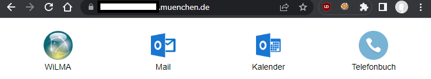
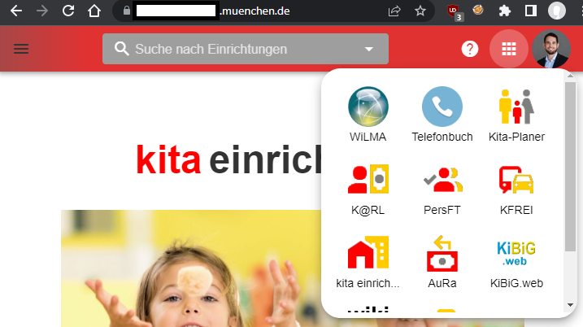

<!-- PROJECT SHIELDS -->

[![Contributors][contributors-shield]][contributors-url]
[![Stargazers][stars-shield]][stars-url]
[![Issues][issues-shield]][issues-url]
[![MIT License][license-shield]][license-url]
[![GitHub Workflow Status][github-workflow-status]][github-workflow-status-url]
[![GitHub release (latest SemVer)][release-shield]][release-url]

# appswitcher-server

**appswitcher-server** renders a simple web page containing icon-based hyperlinks to common web applications used in your (corporate) environment.
The static page is designed to be embedded (e.g. using an `iframe`) into your web applications to provide your users with **a quick way to switch between these applications**.

appswitcher-server was **heavily inspired by** [Google's App Bar](https://support.google.com/accounts/answer/1714464?hl=en#zippy=%2Cswitch-between-apps), which provides a quick way to switch between Google Apps.

At [it@M](https://github.com/it-at-m) we use appswitcher-server internally to offer our customers a quick way to switch between internal or external web applications like the social intranet "WiLMA", the phone book and many other web applications:



The web page of appswitcher-server will be embedded (mostly by using an `iframe`) into the app bar of our web applications (= `client applications`):



If you are using Vue.js/Vuetify or Vaadin Flow to build your frontends, there are already pre-built components which allow integrating the `iframe` very quickly:

- <https://github.com/it-at-m/appswitcher-vue>
- <https://github.com/it-at-m/appswitcher-vaadin>

## Features

### Custom applications

Applications can be freely configured by adding them to the `apps` map in [`application.yml`](src/main/resources/application.yml), for example:

```yml
appswitcher.apps:
  github: # unique key
    display-name: GitHub
    url: https://github.com/it-at-m
    image-url: https://avatars.githubusercontent.com/u/58515289?s=144&v=4
    sort-order: 10
```

| Property       | Description                                                                                                                                            |
| -------------- | ------------------------------------------------------------------------------------------------------------------------------------------------------ |
| `display-name` | Name of the application                                                                                                                                |
| `url`          | URL of the application, will be used for the hyperlink                                                                                                 |
| `image-url`    | URL for the applications image/icon. The image should be quadratic, size should be between `48x48` and `144x144` pixels.                               |
| `sort-order`   | _optional_: Number used for ordering the application in the application listing in ascending order. Applications without an order will be placed last. |

### Tags

Applications can be assigned (multiple) tags. For example, you could use tags to distinguish applications by their application domain like `finance`, `development`, `customer-relations` and so on.

```yml
appswitcher.apps:
  github:
    display-name: GitHub
    url: https://github.com/it-at-m
    image-url: https://avatars.githubusercontent.com/u/58515289?s=144&v=4
    tags:
      - development
```

Client applications (= applications that embed the appswitcher server web page) can request specific tags by using the query parameter `tags`. For example, if you embed the appswitcher in a development centric web application, the client application could request only apps tagged with `development` by using the following url as IFrame `src`:

    https://appswitcher.mycompany.org?tags=development

Client applications can also request multiple tags (e.g. `?tags=development,finance`). This way, an application will be included if it has any of the requested tags.

If a client application does not specify any tags, **by default** only applications tagged as `global` will be included.

### Keycloak integration

If you are using [Keycloak](https://www.keycloak.org/) with OpenID for access management and single sign-on in your environment, you can also add (multiple) client ID(s) to applications that use Keycloak/OpenID for access management.

```yml
appswitcher.apps:
  finance:
    display-name: Finance Reports
    url: https://finance.mycompany.com
    image-url: https://avatars.githubusercontent.com/u/58515289?s=144&v=4
    client-id:
      - finance
```

With this configuration, an icon-based hyperlink to the "Finance Reports" web application will only be included if the current user's access token claim `audience` contains the client id (and [the tags match](#tags) the requested tags). This is based on the [Audience Support](https://www.keycloak.org/docs/latest/server_admin/#audience-support) in Keycloak.

When using the Keycloak integration you can only include web applications that the current user has a permission to access.

Keycloak integration is disabled by default. When enabled, appswitcher-server acts as an OpenID client application to retrieve a user's access token.

This integration works best if your user's operating system propagates a session to the browser and therefore Keycloak, for example Kerberos on Windows.

For the Keycloak integration to work properly, there are a few caveats (IFrame and cookies, X-Frame-Options) to be aware of. See the [wiki page](https://github.com/it-at-m/appswitcher-server/wiki/IFrame-caveats) for more details.

## Configuration

appswitcher-server is a Spring Boot application and can therefore be configured using the [Spring environment abstraction](https://docs.spring.io/spring-boot/docs/current/reference/html/features.html#features.external-config).

| Environment variable   | System/Spring property   | Description                                                           | Default value |
| ---------------------- | ------------------------ | --------------------------------------------------------------------- | ------------- |
| SPRING_PROFILES_ACTIVE | `spring.profiles.active` | Comma seperated list of Spring profiles to activate (e.g. `keycloak`) |               |
| APPSWITCHER_APPS       | `appswitcher.apps`       | Map with applications (see [Features](#features))                     |               |

### Keycloak integration

Keycloak integration can be enabled by enabling the Spring profile `keycloak` (see `SPRING_PROFILES_ACTIVE` in [Configuration](#configuration)).

| Environment variable                   | System/Spring property                 | Description                                                                                          | Default value |
| -------------------------------------- | -------------------------------------- | ---------------------------------------------------------------------------------------------------- | ------------- |
| `APPSWITCHER_KEYCLOAK_CLIENT_ID`       | `appswitcher.keycloak.clientId`        | Client ID of the appswitcher itself.                                                                 |               |
| `APPSWITCHER_KEYCLOAK_CLIENT_SECRET`   | `appswitcher.keycloak.client-secret`   | Client secret.                                                                                       |               |
| `APPSWITCHER_KEYCLOAK_ISSUER_URI`      | `appswitcher.keycloak.issuer-uri`      | Issuer uri (e.g. 'https://keycloak.mycompany.org/auth/realms/myrealm')                               |               |
| `APPSWITCHER_KEYCLOAK_JWK_SET_URI`     | `appswitcher.keycloak.jwk-set-uri`     | JWK set uri (e.g. 'https://keycloak.mycompany.org/auth/realms/myrealm/protocol/openid-connect/certs' |               |
| `APPSWITCHER_KEYCLOAK_SCOPES`          | `appswitcher.keycloak.scopes`          | Comma-seperated list of requested scopes (e.g. 'openid,roles').                                      |               |
| `APPSWITCHER_KEYCLOAK_SSO_SESSION_MAX` | `appswitcher.keycloak.sso-session-max` | Maximum time in seconds before keycloak expires the sso sessions (e.g. '36000' for 10 hours).        |               |

## Using

### Docker

You can use the official container image [ghrc.io/it-at-m/appswitcher-server](https://github.com/it-at-m/appswitcher-server/pkgs/container/appswitcher-server). To provide your [custom Applications](#custom-applications) create a custom `application.yml` containing your applications under the key `appswitcher.apps.*` and mount the file as a volume at `/workspace/config/application.yml`.

### Kubernetes

If you want to deploy appswitcher-server on a Kubernetes cluster, you can use the [official Helm chart][helm-chart-github].

## Build & Development

This project is built with technologies we use in our projects:

- Java
- Maven
- Spring Boot

Build:

```
mvn clean install
```

Run:

```
mvn spring-boot:run -Dspring-boot.run.profiles=demo
```

Visit <http://localhost:8080> to see the generated application link list with the `demo` applications.

## Contributing

Contributions are what make the open source community such an amazing place to learn, inspire, and create. Any contributions you make are **greatly appreciated**.

If you have a suggestion that would make this better, please open an issue with the tag "enhancement", fork the repo and create a pull request. You can also simply open an issue with the tag "enhancement".
Don't forget to give the project a star! Thanks again!

1. Open an issue with the tag "enhancement"
2. Fork the Project
3. Create your Feature Branch (`git checkout -b feature/AmazingFeature`)
4. Commit your Changes (`git commit -m 'Add some AmazingFeature'`)
5. Push to the Branch (`git push origin feature/AmazingFeature`)
6. Open a Pull Request

We use [itm-java-codeformat](https://github.com/it-at-m/itm-java-codeformat), so please make sure to apply the correct code format for your contributions.

## License

Distributed under the MIT License. See [LICENSE](LICENSE) file for more information.

## Contact

it@M - opensource@muenchen.de

[contributors-shield]: https://img.shields.io/github/contributors/it-at-m/appswitcher-server.svg?style=for-the-badge
[contributors-url]: https://github.com/it-at-m/appswitcher-server/graphs/contributors
[forks-shield]: https://img.shields.io/github/forks/it-at-m/appswitcher-server.svg?style=for-the-badge
[forks-url]: https://github.com/it-at-m/appswitcher-server/network/members
[stars-shield]: https://img.shields.io/github/stars/it-at-m/appswitcher-server.svg?style=for-the-badge
[stars-url]: https://github.com/it-at-m/appswitcher-server/stargazers
[issues-shield]: https://img.shields.io/github/issues/it-at-m/appswitcher-server.svg?style=for-the-badge
[issues-url]: https://github.com/it-at-m/appswitcher-server/issues
[license-shield]: https://img.shields.io/github/license/it-at-m/appswitcher-server.svg?style=for-the-badge
[license-url]: https://github.com/it-at-m/appswitcher-server/blob/main/LICENSE
[github-workflow-status]: https://img.shields.io/github/actions/workflow/status/it-at-m/appswitcher-server/build.yaml?style=for-the-badge
[github-workflow-status-url]: https://github.com/it-at-m/appswitcher-server/actions/workflows/build.yaml
[release-shield]: https://img.shields.io/github/v/release/it-at-m/appswitcher-server?sort=semver&style=for-the-badge
[release-url]: https://github.com/it-at-m/appswitcher-server/releases
[helm-chart-github]: https://artifacthub.io/packages/helm/it-at-m/appswitcher-server
